# 🏥 MedicalApp - Healthcare Appointment Management System


## 📋 Overview

MedicalApp is a comprehensive healthcare management platform that connects patients with doctors. It allows patients to book appointments, view prescriptions, and manage their health records, while doctors can manage their schedules, view appointments, and issue prescriptions.

**🔗 Live Demo:** [https://healthcaresystem-1-ndad.onrender.com](https://healthcaresystem-1-ndad.onrender.com)

### Demo Credentials

| Role | Email             | Password |
|------|-------------------|----------|
| 👨‍💼 Admin | admin@test123.com | test123  |
| 👤 Patient | patient@mail.com  | test123  |
| 👨‍⚕️ Doctor | doctor2@mail.com  | test123  |

---

## ✨ Features

### 👤 Patient Features
- ✅ Book appointments with doctors
- ✅ View appointment history with filters
- ✅ Download prescriptions as PDF
- ✅ Find doctors by specialty
- ✅ View doctor profiles and availability

### 👨‍⚕️ Doctor Features
- ✅ Interactive calendar for availability management
- ✅ Click & drag to create time slots
- ✅ Confirm or cancel appointments
- ✅ Upload prescriptions for patients
- ✅ View patient history and profiles

### 👨‍💼 Admin Features
- ✅ Complete user management (doctors/patients)
- ✅ Appointment oversight
- ✅ System monitoring and statistics
- ✅ CRUD operations for all entities

---

## 🖼️ Screenshots

### Landing Page
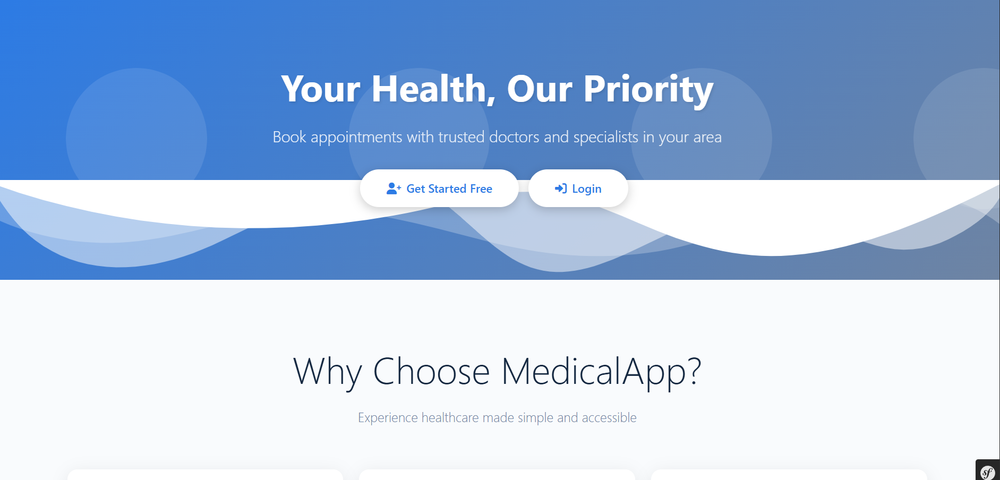

### Authentication
| Register | Login |
|----------|-------|
| 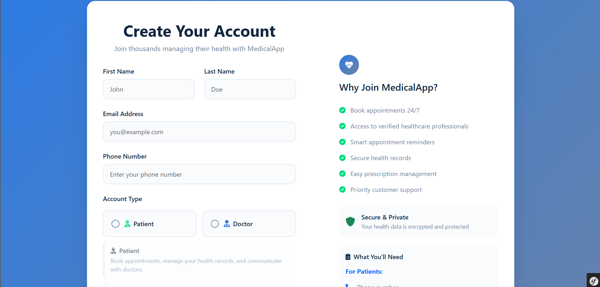 | 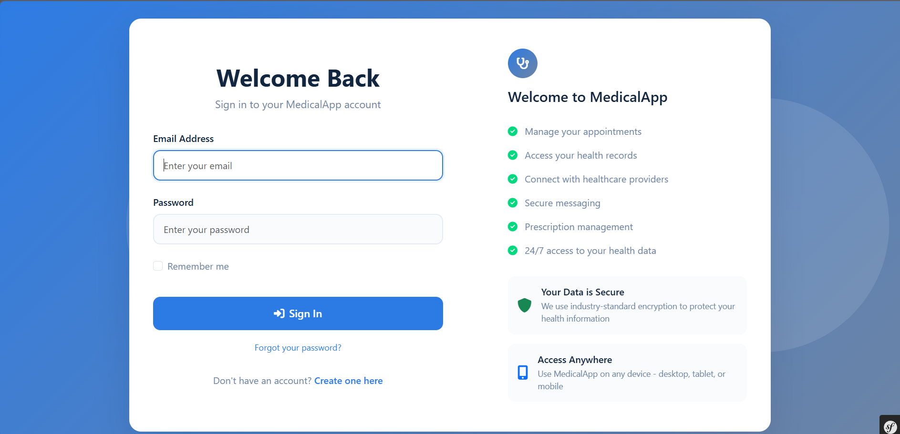 |
| 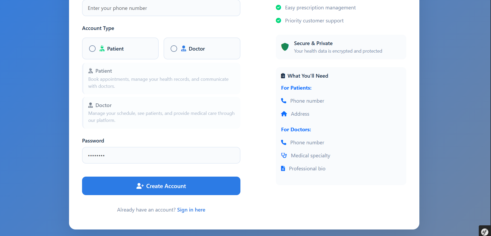 | |

### Patient Panel
| Dashboard | Appointments |
|-----------|--------------|
| 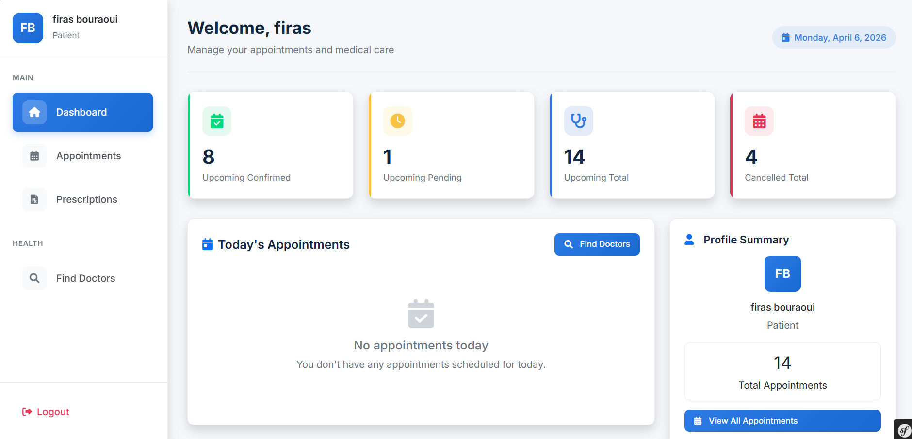 | 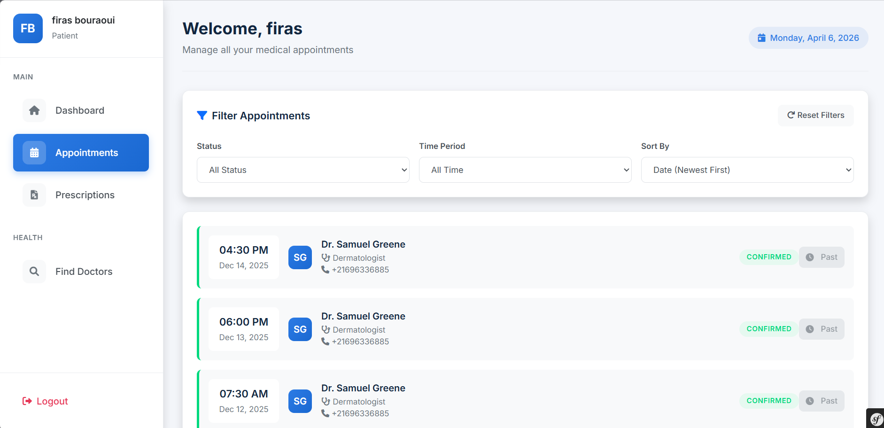 |

| Prescriptions | Find Doctors |
|---------------|--------------|
| 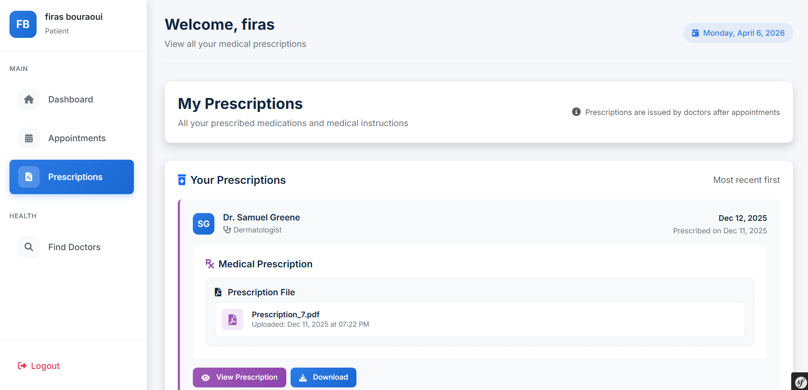 | 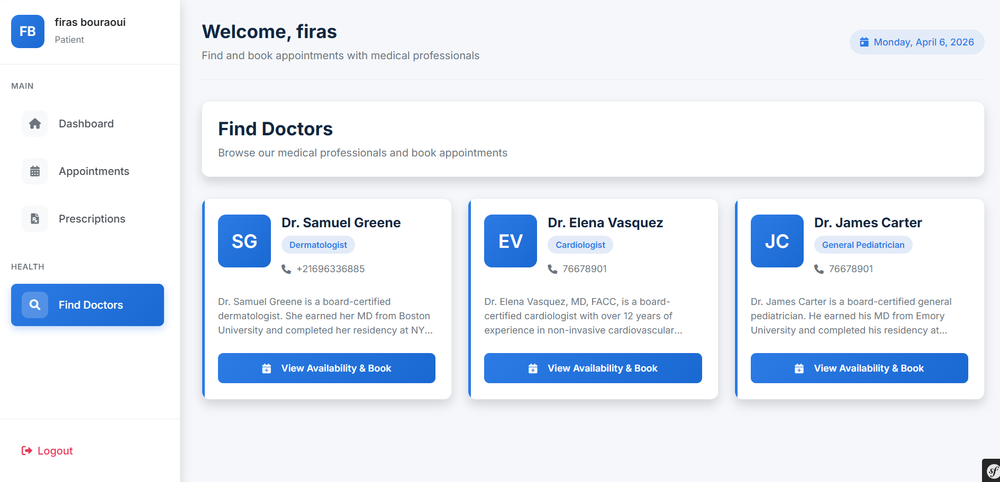 |

### Doctor Panel
| Dashboard | Calendar |
|-----------|----------|
| 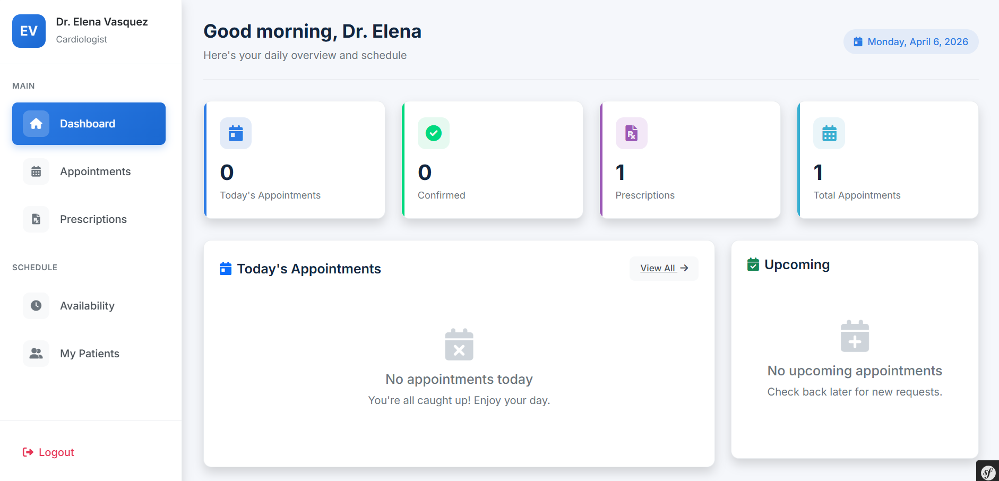 | 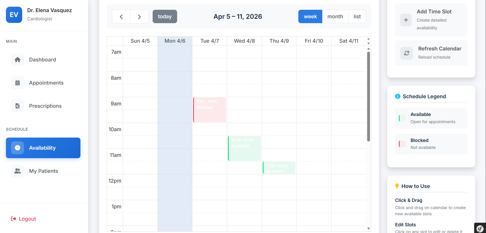 |

| Appointments | Prescriptions |
|--------------|---------------|
| 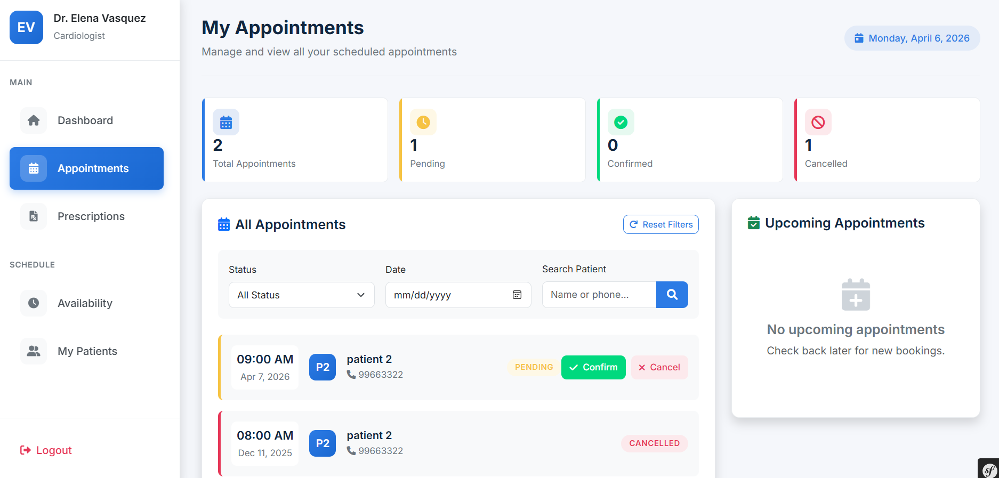 | 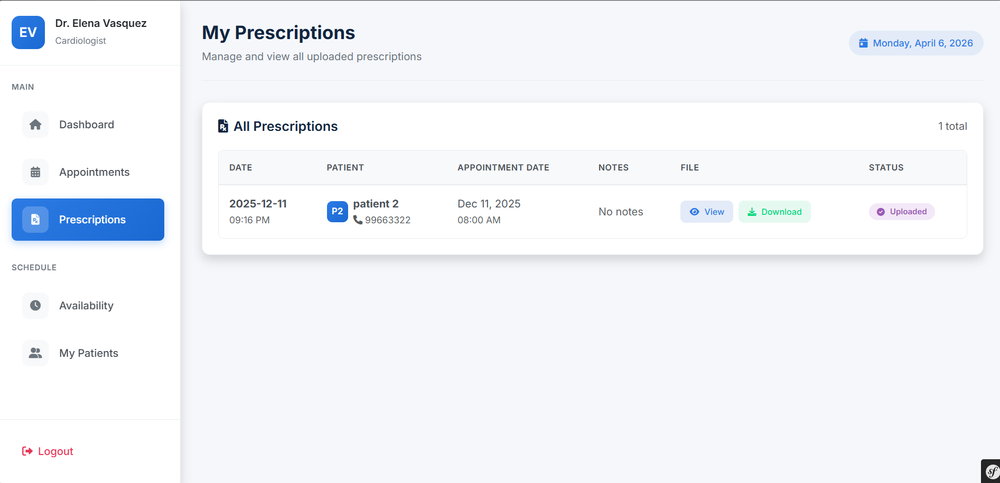 |

| Patients | Availability Booking |
|----------|---------------------|
| 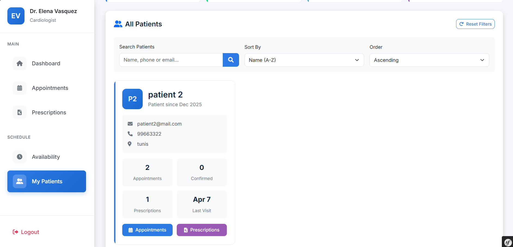 | 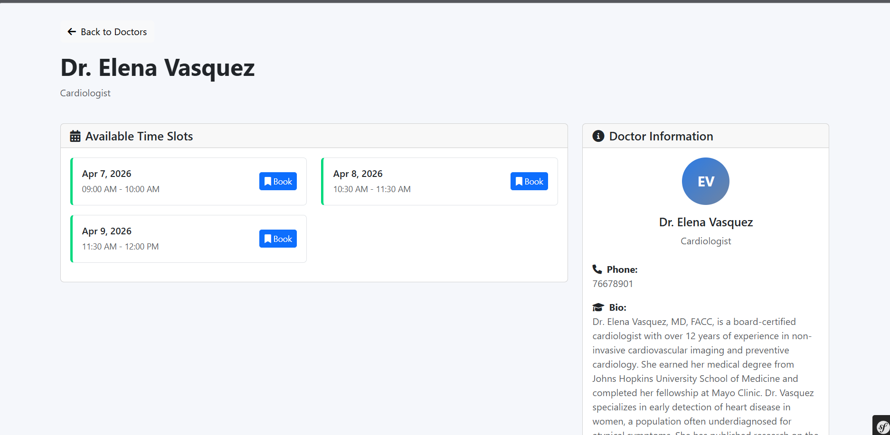 |

### Admin Panel
| Dashboard | Appointments |
|-----------|--------------|
| 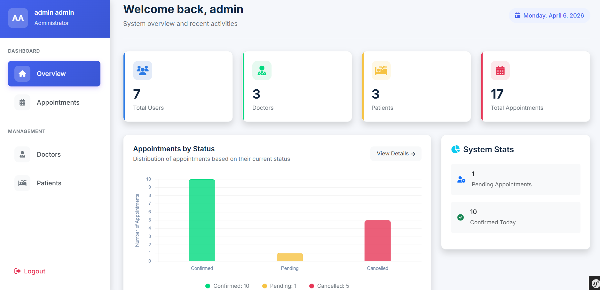 | 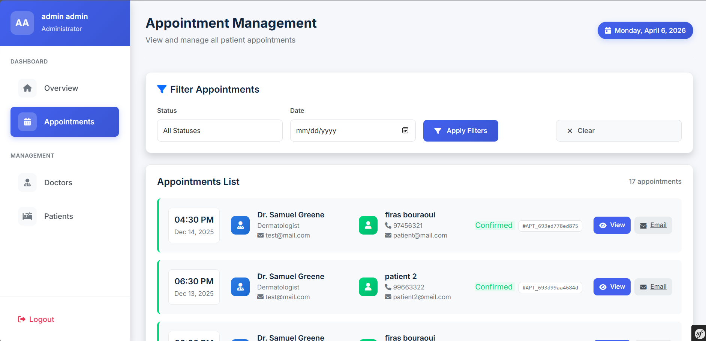 |

| Doctors Management | Patients Management |
|--------------------|---------------------|
| 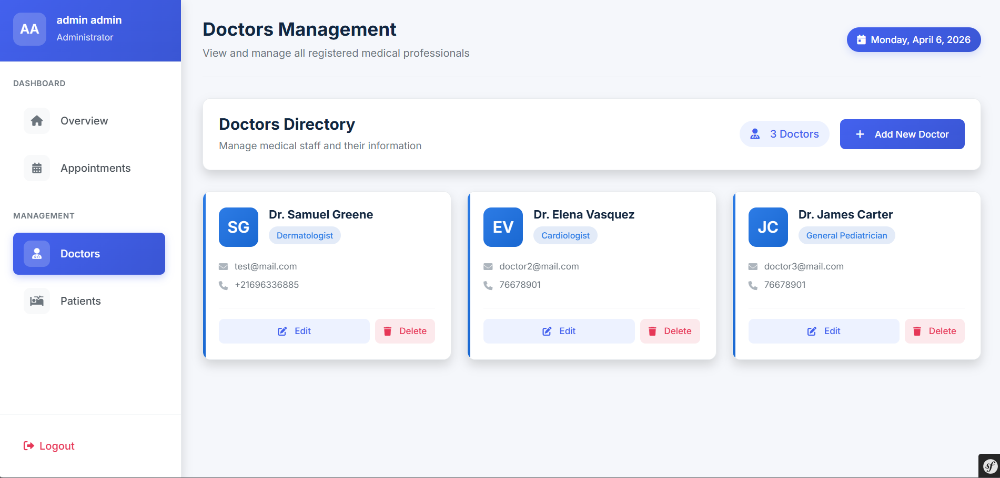 | 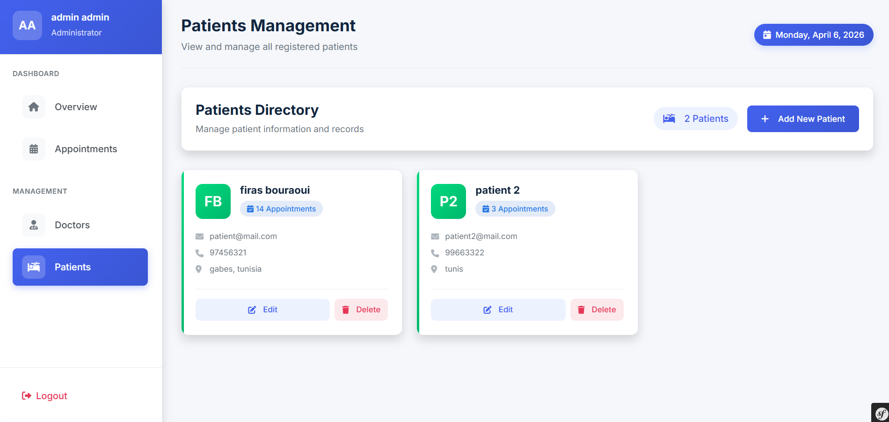 |

---

## 🛠️ Tech Stack

| Category | Technology |
|----------|------------|
| **Backend** | Symfony 6 (PHP 8.2) |
| **Database** | TiDB Cloud (MySQL-compatible) |
| **Frontend** | Bootstrap 5, Twig, FullCalendar.js |
| **Calendar** | FullCalendar.io |
| **Icons** | Font Awesome 6 |
| **Deployment** | Render.com |
| **Container** | Docker |
| **Version Control** | Git & GitHub |

---

## 🚀 Quick Start

### Prerequisites
- PHP 8.2+
- Composer
- MySQL / TiDB Cloud account
- Docker (optional)

### Local Installation

1. **Clone the repository**
```bash
git clone https://github.com/FirasBrr/HealthCareSystem.git
cd HealthCareSystem
